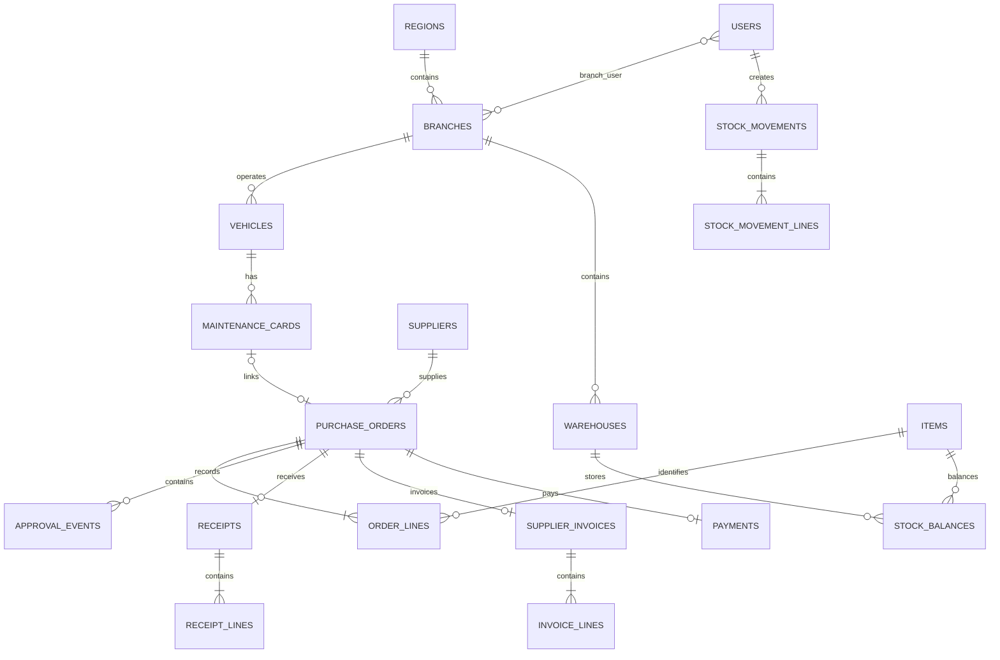

# قاعدة البيانات وقواعد العمل

الجداول تدعم MySQL وSQLite؛ المفاتيح الأجنبية والفهارس والفهارس الفريدة معرفة في `database/migrations`. جميع تواريخ العمل من نوع date، وتواريخ التدقيق timestamps. أسماء الكيانات في الطلب تحفظ كلقطات حتى لا يغيّر تعديل اسم المورد السجل التاريخي.

| المجال | الجداول / الضوابط |
|---|---|
| الصلاحيات | roles, permissions, model_has_roles, model_has_permissions, role_has_permissions؛ guard=web |
| نطاق المستخدم | users.all_branches أو branch_user؛ تحقق خادمي مستقل عن إظهار الأزرار |
| بيانات السيارة | plate_key فريد بعد إزالة المسافات وتوحيد الأرقام؛ VIN فريد عند وجوده؛ العداد لا ينخفض |
| الأرصدة | stock_balances: فريد لكل مخزن وصنف، كمية milli غير سالبة |
| حركات المخزون | UUID فريد لمنع تكرار الطلب؛ source_movement_id للمرتجع، destination_warehouse_id للتحويل |
| مستندات الشراء | receipt/invoice/payment واحد لكل طلب؛ رقم فاتورة فريد لكل مورد؛ مرجع تحويل فريد |
| القيم | *_minor هللات، *_milli أجزاء ألف؛ حركة مخزون بعدد وحدات صحيح؛ نسبة الضريبة basis points |
| المستندات | media بعلاقة polymorphic من Spatie؛ روابط media_id بالفاتورة والحوالة مع منع حذف الملف المرجعي |
| التدقيق | activity_log وapproval_events؛ الفاعل/الوقت/السجل/التغيير؛ لا تسجل كلمات المرور |

عمليات الدورة والمخزون والدفع داخل Transactions مع أقفال صفوف `lockForUpdate` ومحاولات إعادة عند deadlock. يمنع حذف الكيانات ذات الروابط؛ الواجهة تقدم تعطيلًا بدل الحذف. إلغاء/مرتجع مالي بعد الدفع ليس جزءًا من هذه الدورة، ولا يسمح بتعديل الفاتورة أو الاستلام بعد السداد. هذه إدارة مشتريات ومخزون وليست دفتر أستاذ محاسبيًا مزدوج القيد.

الصور محفوظة كملفات خاصة، لا كـ BLOB داخل القاعدة. كميات الفاتورة والاستلام تربط بسطر الطلب نفسه. كل رقم طلب وحركة ينشأ من المفتاح الأساسي لتجنب تصادم الأرقام المتزامنة.
